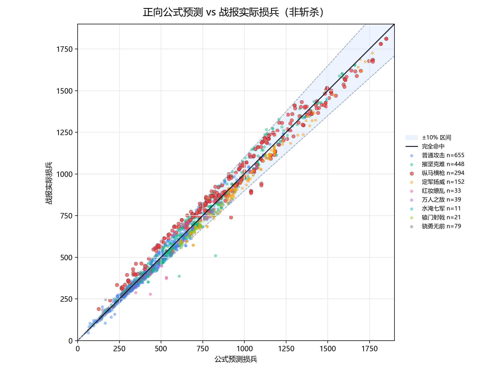
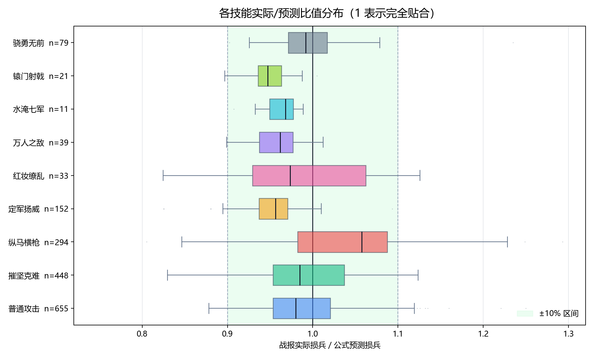

# 三国谋定天下 — SQLite-first 战报分析与伤害公式反推

> **诚邀共建！** 目前武力型伤害公式已基本稳定，但**谋略伤害还没有开始推导**。数据库里已有大量原始流水，场外属性、兵力因子、品级项等基础乘区也已完成。如果你对游戏数值反推感兴趣，欢迎 Fork 并提交 PR，一起把公式补全。


[](LICENSE)
[](pyproject.toml)

一个 **SQLite-first** 的《三国谋定天下》战报分析工具集。核心目标是从游戏战斗流水数据中**反推伤害公式**，而非依赖官方或不完整的社区信息。

## 核心成果

### 1. 普攻/武力型战法正向公式

从 1700+ 条伤害记录中推导出的完整计算公式，预测与实际伤害的**中位误差仅 4.3%**，**95% 的预测落在 10% 误差内**：

```
pred = (300 + 0.5 * 首回合前武力) * 出手时武力 / (目标统率 + 160)
     * 战法系数 * 兵力因子 * 兵种克制 * 攻方增伤桶 * 目标受伤桶
     * 会心奇谋倍率 * 特殊乘区 * 品级项
```



### 2. 按技能误差分布

各技能的观测/预测比值稳定在 **0.95-1.05** 之间，表明公式结构正确：



### 3. 关键子项独立验证

| 子项 | 结论 | 文档 |
|------|------|------|
| **兵力因子** | `F(N)=1 (N>=9000), (N/9000)^0.38` | [troop_factor_analysis.md](docs/troop_factor_analysis.md) |
| **普攻基础项** | ~287，对数线性关系而非二次 | [normal_attack_damage_formula.md](docs/normal_attack_damage_formula.md) |
| **属性项结构** | 确认 `300 + 0.5*场外` 的攻防项形式 | [forward_force_damage_formula_20260623.md](docs/forward_force_damage_formula_20260623.md) |
| **品级隐式项** | 每品 ~1% 造成伤害 + 1% 免伤 | [codex_lessons.jsonl](docs/codex_lessons.jsonl) |


AGENTS.md 是本项目的 agent 指令文件，可直接作为 **Codex** 或 **Claude Code** 的项目文件夹使用，agent 会自动读取其中的规则、口径和约束来辅助分析和开发。

## 安装

```bash
# 基本安装
pip install -e .

# 含抓取功能（需要 Frida）
pip install -e ".[capture]"

# 含开发依赖
pip install -e ".[dev]"
```

## 目录结构

```
data/
  sanmou_battles.sql          # SQL dump — 唯一事实源
  raw_captures/               # 原始战报捕捉文本
src/sanmou/
  db.py                       # 数据库连接与查询
  analysis/                   # 分析逻辑（属性、兵力因子等）
  capture/                    # Frida 抓取模块
scripts/                      # 命令行脚本入口
  forward_force_damage_formula.py   # 正向公式拟合
  analyze_troop_factor.py           # 兵力因子拟合
  audit_off_battle_attributes.py    # 场外属性审计
  inherit_report_config.py          # 配置继承
  ...
docs/                         # 公式推导、口径记录、图表
```

## 核心方法论

### 数据流

```
原始战报捕捉 -> Markdown（人工检查件）
                  |
          配置补全 & 导入 SQLite
                  |
          SQLite = 唯一事实源
                  |
        剥离乘区 -> 拟合子项 -> 组装正向公式
```

### 关键约束

- **不从 Markdown 反向解析**战斗流水
- NPC（兵力 16000 或 >11000）红度/品级/战法红度强制为 0，韬略为「无韬略」
- `docs/codex_lessons.jsonl` 记录取数口径和踩坑修正
- `docs/codex_milestones.jsonl` 记录阶段性结论

### Base 剥离体系

要从观测伤害反推基础项，需逐层剥离以下乘区：

```
Base = D_obs / 技能倍率 / 兵力因子 / 兵种克制 / 增伤桶 / 受伤桶
     / 品级隐式项 / 会心奇谋倍率 / 特殊乘区
```

详见 [base_damage_reconstruction.md](docs/base_damage_reconstruction.md)。

---

## 代表性准确度

| 口径 | 样本数 | 精确命中 | +-1 | 5% 内 | 10% 内 | 中位误差 |
|------|------:|------:|------:|------:|------:|------:|
| 全部含斩杀 | 1769 | 3.2% | 5.4% | 55.1% | 92.2% | 4.45% |
| 非斩杀-普攻 | 655 | 1.7% | 4.7% | 58.8% | 95.1% | 4.35% |
| 非斩杀-兵刃战法 | 1077 | 0.8% | 2.6% | 51.3% | 90.2% | 4.80% |

## 许可证

MIT — 详见 [LICENSE](LICENSE)。


